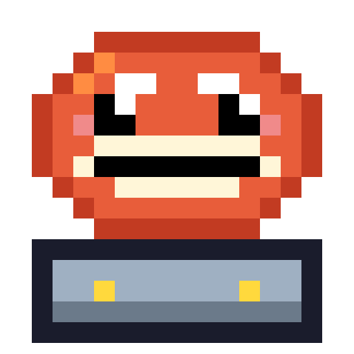
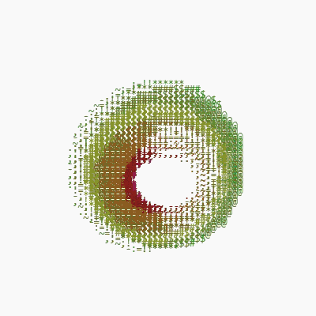
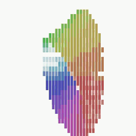
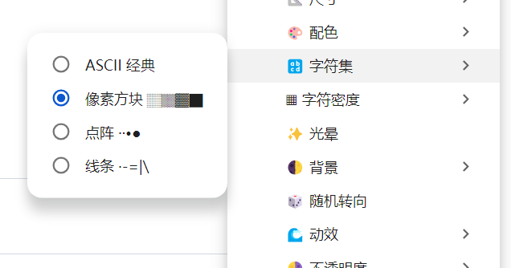
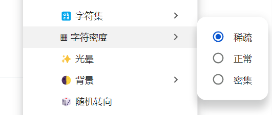
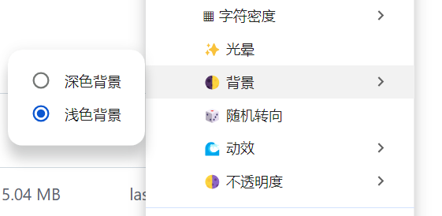
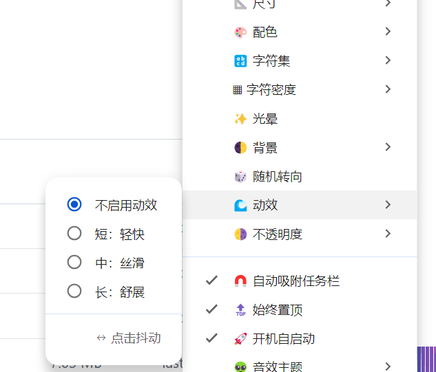

# keepBoard

<p align="center">
  
</p>
<p align="center">
  
</p>

字符画 3D 桌面宠物 + 键鼠/屏幕时间统计工具。十种程序化 3D 形状蹲在你的任务栏旁：可由键鼠互动驱动，也可切到自动档自行运动；同时默默记录你的每一次输入。

基于 **Electron + React + TypeScript + Canvas/WebGL2** 构建。

## ✨ 功能特性

| 模块 | 说明 |
|------|------|
| 🍩 3D 字符画宠物 | 支持甜甜圈、地球仪、立方体、DNA、莫比乌斯环、爱心、土星、水母、彩虹、立体鱼十种程序化形状；共享透视投影、深度缓冲、字符光照和彩虹渐变（[尺寸说明](./docs/形状填充与窗口尺寸.md) · [扩展规划与公式](./docs/形状扩展规划.md)） |
| 🎮 GPU 字符渲染 | 默认使用 WebGL2 字符图集与实例化绘制，一次 draw call 提交字符；WebGL2 不可用时自动回退 Canvas 2D（[技术说明](./docs/GPU字符渲染.md)） |
| ⌨ 全局统计 | 全局键盘（按字母/数字/功能键/修饰键/方向键/大键/其他七类分类）、鼠标左右中键、滚轮、峰值 APM、最长会话 |
| 📊 今日面板 | 实时展示当天键击、点击、屏幕使用时长、峰值 APM、最长会话、按键分类（主指标卡 + 横向条形图） |
| 📈 每周报告 | 本周/历史周统计翻阅、日均 APM/最佳日、每日柱状图、一键导出 CSV 周报（带导出提示） |
| 🖥 屏幕时间 | 30s 空闲判定，自动累计有效使用时长 |
| 🎨 右键菜单 | 纯右键交互：形状切换、尺寸调节、配色（含多套自定义外观）、字符集、字符密度、光晕、背景、随机转向、档位、动效（含点击抖动）、音效主题、音量、不透明度、置顶/吸附开关、立即重新吸附、统计入口、退出 |
| ⚙️ 档位与运动 | 手动挡由键盘/鼠标/滚轮驱动，采用目标速度平滑加减速；自动挡慢/中/快以连续目标转速自行运动。随机转向会在自动挡中低频、平滑地变更方向 |
| 🎬 输入反馈动效 | 手动挡下键盘/鼠标/滚轮触发三类输入脉冲反馈；四档动效时长（关闭/短/中/长）；点击左右抖动；每 1000 键击触发里程碑庆祝 |
| 🔊 音效主题 | 五套程序化合成音色（👻 宇宙幽灵 / 🤖 机器人 / 👾 8-bit 芯片 / 💧 水滴 / ⛪ 圣歌管风琴）；音效只响应真实的敲键、点击和滚轮事件，与当前档位无关；自动运动不会发声。Web Audio 实时合成、立体声 + 回声，无需音频文件 |
| 🧲 任务栏吸附 | 自动检测任务栏位置（上/下/左/右），拖动松手后自动吸附；任务栏位置/显示器变化时自动重新吸附 |
| 👆 鼠标穿透 | 宠物窗口仅字符形状区域拦截鼠标，空白透明区域点击自动穿透到桌面，不遮挡下方窗口（可正常拖拽） |
| 🔝 窗口特性 | 宠物为无边框透明置顶窗口、不占任务栏；统计面板为独立置顶窗口（可调大小、占任务栏） |
| 🔒 单实例 | 重复启动时聚焦已有窗口，避免双份全局钩子与统计文件互相覆盖 |
| 🚀 开机自启 | 一键开关，写入系统登录项 |

### 🧮 程序化形状

| 形状 | 核心方法 |
|------|----------|
| 🍩 甜甜圈 | 经典 `donut.c` 环面参数方程与表面采样 |
| 🌍 地球仪 | 屏幕空间球面求交、经纬度陆地掩码与地形着色 |
| 🧊 立方体 | 六面规则采样、旋转法线光照与 Z-buffer |
| 🧬 DNA 双螺旋 | 两条相差 π 的螺旋曲线与周期横杆 |
| ➰ 莫比乌斯环 | 单侧参数曲面与解析法线双面光照 |
| ❤️ 爱心 | 三维隐式多项式曲面、缓存体素化表面与梯度法线 |
| 🪐 土星 | 球体/星环统一射线求交、正确前后遮挡，以及输入驱动的进动、章动和经向色纹自转 |
| 🪼 水母 | 半球伞盖、波动触手与 12 FPS 低功耗待机动画 |
| 🌈 彩虹 | 半圆拱形立体管弧色带；输入驱动「行进波」沿拱起伏（整条彩虹如丝带舞动，惯性滑行、端点反弹），静止时缓慢呼吸 |
| 🐠 立体鱼 | 椭球鱼身、尾鳍、背鳍、腹鳍与眼部组成的三维字符鱼；网格越细，曲面采样越精细；持续摆尾并从窗口两侧游进游出，受键鼠和自动挡转速影响姿态 |

手动挡动画由全局键鼠输入驱动；速度衰减至零后会暂停逐帧渲染，下一次输入再自动唤醒，以降低桌面常驻时的空闲 CPU 占用。自动挡维持对应档位的连续目标速度。水母保留约 12 FPS 的低功耗待机动画。完整公式、复杂度和后续候选方案见[形状扩展规划](./docs/形状扩展规划.md)。

## 📦 环境要求

- [Node.js](https://nodejs.org) ≥ 18（含 npm）
- **Windows** 10/11（完整体验）或 **Linux** 桌面（X11 会话）

## 🚀 快速开始

### 方式一：一键脚本（推荐）

```cmd
:: Windows
scripts\dev.cmd
```

```bash
# Linux / macOS
bash scripts/dev.sh
```

首次运行会自动安装依赖，然后启动 Vite 热更新 + Electron 窗口。

### 方式二：手动命令

```bash
npm install        # 安装依赖
npm run dev        # 启动开发模式
```

### 关于全局输入统计的说明

应用内置 [uiohook-napi](https://github.com/SnosMe/uiohook-napi) 原生钩子（N-API 预编译二进制，无需本地编译），开箱即用，全局记录键鼠事件且**不会劫持或拦截任何按键**。

若原生模块加载失败（如被安全软件拦截），会自动降级为"仅统计 keepBoard 窗口内的输入"，不影响正常打字。

## 🧰 打包发布

### Windows

```cmd
scripts\build-installer.cmd
```

### Linux / macOS（构建 Linux 包）

```bash
bash scripts/build-installer.sh
```

两个平台流程完全一致：**清理旧产物 → 重新生成图标 → 全量构建 → electron-builder 打包**。

### 方式二：手动命令

```bash
npm run package          # Windows：含 prepackage 钩子（icons + build + electron-builder）
npm run package:linux    # Linux：AppImage + deb
```

产物输出在 `release\` 目录：

| 文件 | 说明 |
|------|------|
| `keepBoard-Setup-<版本>-x64.exe` | Windows NSIS 安装版（可选安装目录、创建快捷方式） |
| `keepBoard-Portable-<版本>-x64.exe` | Windows 便携单文件版，免安装直接运行 |
| `keepBoard-<版本>-x64.AppImage` | Linux AppImage，chmod +x 后直接运行 |
| `keepBoard-<版本>-x64.deb` | Debian/Ubuntu 系安装包 |

> ⚠️ Linux 包（AppImage/deb）依赖 mksquashfs 与 fpm 等原生工具，**必须在 Linux 上构建**——直接在目标平台运行上面的脚本即可；Windows 无法交叉产出 Linux 包。

## 🐧 Linux 平台支持说明

| 功能 | X11 会话 | Wayland 会话 |
|------|----------|--------------|
| 宠物渲染 / 动画 / 统计 / 面板 | ✅ | ✅ |
| 全局键鼠捕获 | ✅ | ❌ 系统限制（自动降级为仅统计本窗口） |
| 透明窗口 / 托盘图标 | ✅* | ✅* |
| 拖拽移动 / 任务栏吸附 | ⚠️ 取决于 WM | ❌ Wayland 禁止程序自定位窗口 |
| 开机自启 | ✅ 自动写入 `~/.config/autostart/` | 同左 |

\* GNOME 需安装 AppIndicator 扩展；KDE 原生支持。

检测到 Wayland 时应用会自动降级并在日志中提示，可切换到 X11 会话获得完整功能。

## 🕹 使用说明

- **移动**：按住宠物拖拽，靠近任务栏松手自动吸附
- **鼠标穿透**：宠物空白区域不拦截鼠标，点击会穿透到下方桌面；只有字符形状本身可以点中/拖拽
- **旋转与档位**：默认「手动挡」下，敲键盘、点击鼠标或滚动滚轮会平滑地累积转速，停止输入后自然减速；「自动挡慢／中／快」会持续自行运动，键鼠不再触发宠物动画
- **音效**：无论档位如何，音效只由真实的键盘、鼠标点击和滚轮事件触发；自动运动始终静音
- **右键菜单**：右键点击宠物弹出完整菜单：
  - 📊 今日统计 / 📈 本周统计
  - 🧊 形状切换（🍩 甜甜圈 / 🌍 地球仪 / 🧊 立方体 / 🧬 DNA / ➰ 莫比乌斯环 / ❤️ 爱心 / 🪐 土星 / 🪼 水母 / 🌈 彩虹 / 🐠 立体鱼）
  - 📐 尺寸调节（180 / 240 / 320 / 400 / 480 / 640 px，形状自动填满窗口）
  - 🎨 配色（经典彩虹 / 霓虹 / 赛博朋克 / 极光 / 日落 / 海洋 / 森林 / 马卡龙 / 鎏金 / 自定义）
  - 🔡 字符集（ASCII 经典 / 像素方块 ░▒▓█ / 点阵 ·∙•● / 线条）
  - ▦ 字符密度（稀疏 / 正常 / 密集）
  - ✨ 光晕开关 · 🌓 背景（深色/浅色）· 🎲 随机转向
  - ⚙️ 档位（手动挡 / 自动挡慢 / 自动挡中 / 自动挡快）
  - 🌊 动效（不启用 / 短：轻快 / 中：丝滑 / 长：舒展，含 ↔ 点击抖动）
  - 👽 音效主题（🔇 不启用音效 / 👻 宇宙幽灵 / 🤖 机器人 / 👾 8-bit 芯片 / 💧 水滴 / ⛪ 圣歌管风琴）
  - 🔉 音量（10% ~ 100% 每 10% 一档，默认 50%；不启用音效时自动禁用）
  - 🌗 不透明度 / 🔝 置顶开关 / 🧲 吸附开关 / 📌 立即重新吸附
  - ❌ 退出
- **托盘**：左键唤起窗口，右键弹出托盘菜单
- **数据目录**：Windows 在 `%APPDATA%\keepboard`，Linux 在 `~/.config/keepboard`（含 `keepboard-store.json` 统计数据与 `keepboard-look.json` 外观配置；日数据自动清理 180 天前的）

### 🎨 自定义外观（keepboard-look.json）

「配色」菜单底部有「📂 打开配置文件」——点击会自动创建（如果还没有）并用系统编辑器打开 `keepboard-look.json`。它支持**多套**自定义外观，每套有自己的 `id`、`name`（菜单显示名）和 `icon`（菜单图标）。文件格式：

```json
{
  "looks": [
    {
      "id": "custom-neon",
      "name": "我的霓虹",
      "icon": "🎇",
      "tone": "bright",
      "saturation": "neon",
      "palette": "cyber"
    },
    {
      "id": "custom-moon",
      "name": "暗夜极光",
      "icon": "🌙",
      "tone": "dark",
      "saturation": "vivid",
      "palette": "aurora",
      "colors": ["#00ffaa", "#7733ff"],
      "gamma": 0.55
    }
  ]
}
```

每个 look 的字段（除 `id`/`name` 外都可省略）：

| 字段 | 取值 | 说明 |
|---|---|---|
| `id` | 字符串（唯一） | 标识，不要与内置配色 id 重名 |
| `name` | 字符串 | 菜单里显示的名字 |
| `icon` | 字符串（emoji） | 菜单里显示的图标 |
| `tone` | night / dark / mid / bright / high | 整体明度 |
| `saturation` | gray / muted / normal / vivid / neon | 鲜艳度 |
| `palette` | rainbow / neon / sunset / ocean / mono / aurora / cyber / candy / gold / forest | 色相渐变 |
| `gamma` | 数字（0.5~1） | 明暗阶梯权重，越小越偏向重字符 |
| `colors` | hex 数组（如 `["#ff00aa","#00ffff"]`） | 自定义色带，覆盖 `palette`，自动插值成 16 步 |
| `chars` | 字符串 | 直接覆盖整个明暗阶梯（覆盖「字符集」菜单） |

这些自定义外观会出现在「配色」菜单里、内置预设下方（用一条横线隔开）。选中后即生效；编辑文件后重新点一次该外观即可刷新。文件位置：Windows `%APPDATA%\keepboard\keepboard-look.json`，Linux `~/.config/keepboard/keepboard-look.json`。

### 🔧推荐的配置（v0.13.0)

<p align="center">
  
</p>

<p align="center">
   
</p>


<p align="center">
  
</p>

<p align="center">
  
</p>

<p align="center">
  
</p>


## 📁 项目结构

```
keepBoard/
├── electron/            # 主进程
│   ├── main.ts          # 入口：窗口/托盘/IPC/统计调度
│   ├── hooks.ts         # 全局键鼠钩子（原生模块优先 + 回退）
│   ├── store.ts         # JSON 文件持久化（设置 + 日统计）
│   ├── statsUtils.ts    # 周/日聚合、CSV 导出、按键分类
│   ├── windowManager.ts # 任务栏吸附逻辑
│   ├── menu.ts          # 托盘菜单、开机自启
│   ├── taskbar.ts       # 任务栏位置/边缘检测
│   ├── preload.ts       # 渲染进程桥（contextBridge 暴露 keepboard API）
│   ├── sizeLog.ts       # 窗口尺寸变化日志
│   └── types.ts         # 主进程共享类型（Settings/DailyStats 等）
├── src/                 # 渲染进程 (React)
│   ├── main.tsx             # 入口：按 hash 分流宠物窗口(#无) / 统计窗口(#stats)
│   ├── App.tsx              # 宠物窗口根组件
│   ├── StatsApp.tsx         # 统计窗口根组件（独立窗口渲染今日/本周面板）
│   ├── index.css            # 全局样式（含 .stats-shell 统计窗口壳）
│   ├── components/
│   │   ├── PetCanvas.tsx    # 八种程序化 3D 字符形状 + 输入/待机动画 + 字符格鼠标穿透
│   │   ├── DailyPanel.tsx   # 今日统计面板
│   │   └── WeeklyPanel.tsx  # 每周统计面板
│   └── lib/
│       ├── types.ts         # 共享类型定义
│       ├── palette.ts       # 面板配色常量
│       ├── audioEngine.ts   # 多主题程序化合成音效引擎（Web Audio）
│       └── webglGlyphRenderer.ts # WebGL2 字符图集与实例化渲染器
├── assets/icons/        # 应用图标（从 docs/img/icon.png 生成，已入库）
├── docs/                # 文档与图标源文件
│   ├── 形状填充与窗口尺寸.md   # 投影缩放标定、拖动/吸附的尺寸与位移问题
│   ├── 形状扩展规划.md         # 候选形状、计算公式、复杂度与实施批次
│   ├── GPU字符渲染.md          # CPU/GPU 分工、字符图集、回退与命中遮罩
│   └── 性能与体验升级设计方案.md # 性能(WASM 下沉)与体验升级规划草案（尚未实施）
├── scripts/
│   ├── generate-icons.mjs  # 图标生成器（从源图缩放）
│   ├── sync-version.mjs    # 从 version.txt 同步版本号到 package.json
│   ├── version.txt         # 版本号单一来源
│   ├── dev.cmd / dev.sh    # 一键开发脚本
│   └── build-installer.cmd / build-installer.sh  # 一键打包脚本
└── dist/ dist-electron/ release/   # 构建产物（git 忽略，可随时重新生成）
```

## 📜 License

[MIT](https://opensource.org/licenses/MIT)
